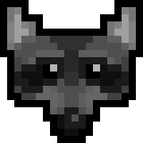

<h1 align="center">
  
   
    Nerd Bot
</h1>

<h1 align="center">
  
  
  
  
  
</h1>

# Features

## Activity Tracking

The bot tracks the activity of all users in the server and saves the data to a database. There are a number of commands
that will display this information in a human-readable format.

## Reminders

Users can create one-time reminders that are either sent publicly or privately based on the user's preference.

## Endpoint Polling

The bot will periodically poll the Hypixel API and the Hypixel Forums for the latest SkyBlock news, updates, Fire Sales,
and more. New updates are then posted in an assigned channel.

When a new update is found, the bot will send a message in the assigned channel and ping a role defined in code. This
role is defined in the config file.

## Suggestion Curation

The bot will periodically review defined suggestions channels and determine if a suggestion has enough votes to be
considered to be greenlit. Values used to determine if a suggestion is greenlit are defined in the config file.

If a suggestion is greenlit, the bot will assign the 'Greenlit' tag to the suggestion which can be used for filtering.

## User Verification

Users are able to link their Minecraft account to their Discord account by using the `/verify` command. This command
checks the Hypixel API to ensure that the user's Discord account is linked to the specified Minecraft account through
the Hypixel Network's in-game social menu.

## Item Generation

The bot can generate images of Minecraft items, tooltips, and crafting recipes with user-provided data.

## Mod Mail

Users can send messages to the server's management team by sending a DM to the bot. The bot will then forward the
message to the staff team, and they can respond to the user by replying to the bot's message in the appropriate thread.

## Mod Logs

The bot tracks and logs a number of events that occur in the server. These events include message edits, message
deletes, user joins, user leaves, and more.

## Reaction Channels

These are channels that are defined in the config file that the bot will monitor for new messages and add reactions to
them.

## Metrics

The bot tracks a number of custom metrics that are implemented using Prometheus. These metrics can then be viewed using
a dashboard of your choice that supports Prometheus.

# Running the bot

Please follow the instructions [here](https://github.com/TheMGRF/NerdBot/blob/master/CONTRIBUTING.md)

# Commands

See the [commands](https://github.com/TheMGRF/NerdBot/tree/master/src/main/java/net/hypixel/nerdbot/command) package.
